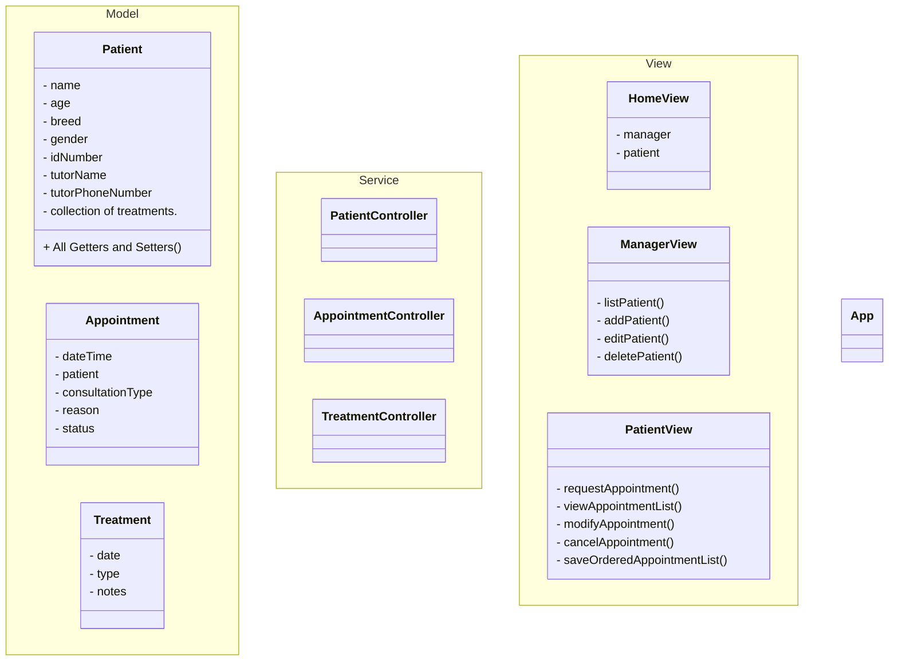

# BREMEN's Codeeers
    Clínica Veterinaria 

# Descripción con sinopsis del proyecto

# Pre-requisitos (Que se necesita instalar para poder ejecutar el proyecto)

# Pasos para la instalación

# Ejecución de los tests (Captura de la cobertura)

# Diagramas realizados

# Autores

@abdiaslabrador @Andreina2 @KARELIZ01 @NelliYanchuk @ofiucoder

# Codeeers

## …or create a new repository on the command line
> echo "# ClinicaVeterinaria" >> README.md
> git init
> git add README.md
> git commit -m "first commit"
> git branch -M main
> git remote add origin https://github.com/coder0fiu/ClinicaVeterinaria.git
> git push -u origin main

## …or push an existing repository from the command line
> git remote add origin https://github.com/coder0fiu/ClinicaVeterinaria.git
> git branch -M main
> git push -u origin main