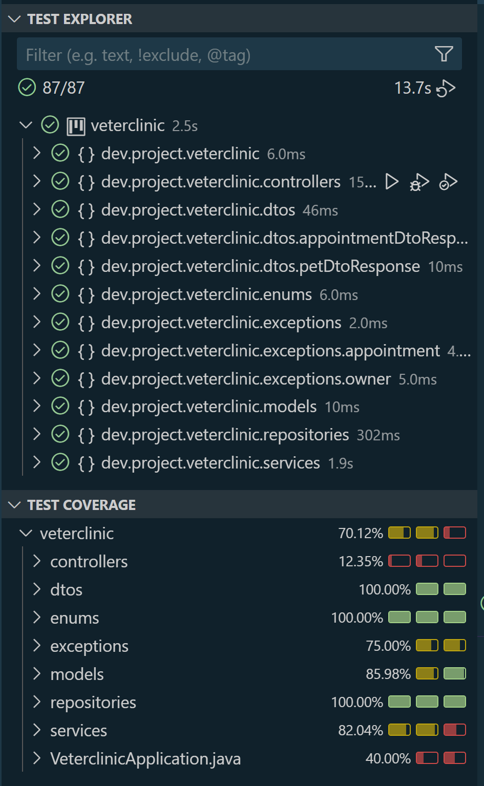
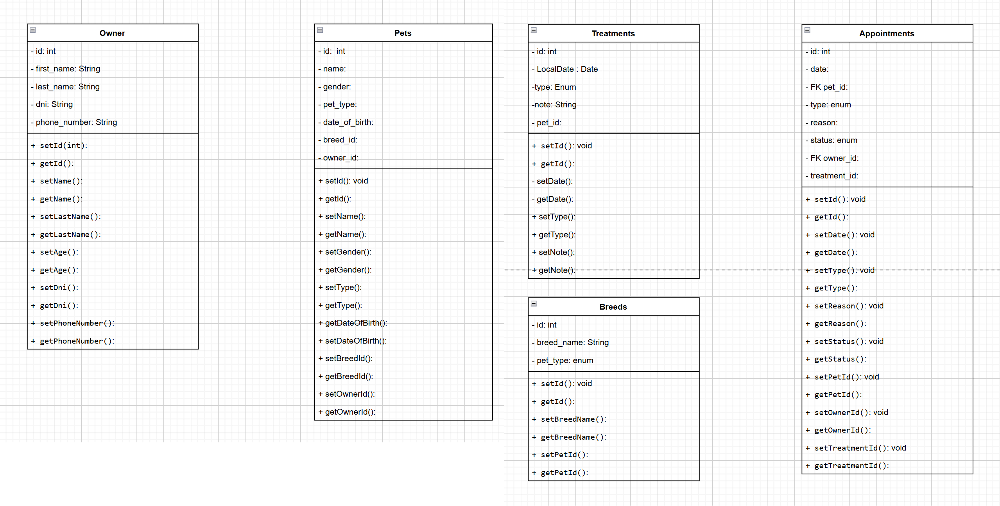
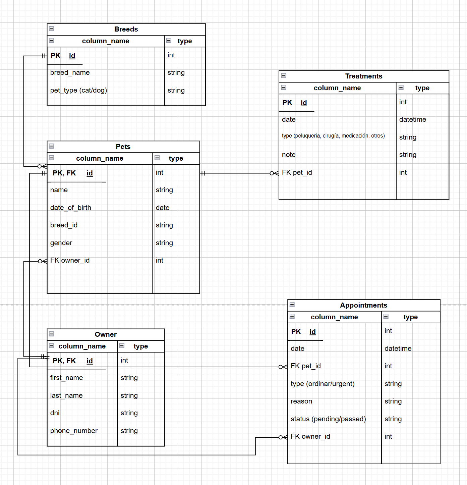
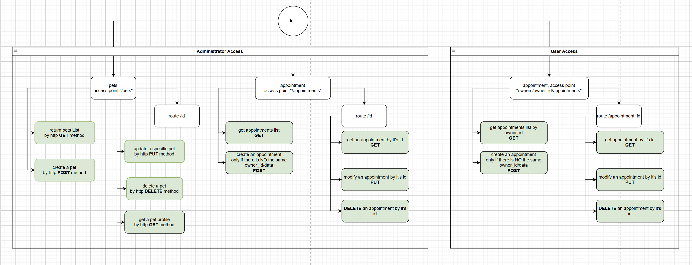

# Project - Veterinary Clinic

## Project Description

This project aims to develop a patient management system for a veterinary clinic that will be run by Margarita, who is about to open her clinic for cats and dogs. The application will allow efficient management of patients and appointments, providing a REST API that interacts with an in-memory database (H2 Database) or a dockerized MySQL database.

## Project Objectives

1. **Reinforce object-oriented programming (OOP) concepts** for the students.
2. Apply **encapsulation** to protect the data and implement robust classes.
3. Develop a **flowchart** that explains the client management system.
4. Implement the **code** that represents the proposed diagram.

## Functional Requirements

### Patient Management
- **List, add, modify, and delete patients**.
- Each patient must have a **profile** with:
    - Name
    - Age
    - Breed
    - Gender
    - ID number
    - Name and surname of the owner
    - Owner's phone number
- Access to a patient's data **via their ID number**.
- The API must record and provide **treatments performed** for each patient.

### Appointment Management
- List, add, modify, and delete appointments.
- Each appointment must include:
    - Date and time
    - Patient
    - appointments type Standard consultation or emergency
    - Appointment reason
    - Appointment status (pending, passed)


## Technical Requirements

- **Knowledge of programming in Java**.
- **Knowledge of Object-Oriented Programming (OOP)**.
- Implementation of **best practices** in the code development.
- **Unit tests** for models, services, and controllers.
- **Test coverage**: at least 70%.


## Expected Deliverables

1. **Patient management system** implemented in Java using the Spring and Spring Boot framework, meeting the previously mentioned requirements.
2. **Controllers, Services, and Models** with unit tests.
3. **Test coverage**: at least 70%.
4. **GitHub repository** with the corresponding README.
5. **Screenshot of test coverage**.

## Project Timeline

- **3-week sprint**.

## Performance Criteria

- The **backend architecture layers** should be well-defined.
- The **database tables** should be **normalized**.
- **Unit tests** should cover the main functionalities of the system.

---

## Project Structure

This project is organized using **Spring Boot** to create a REST API. Below are the main layers of the system:

- **Controllers**: Handle HTTP requests and delegate business logic to services.
- **Services**: Contain business logic and handle interactions with models.
- **Models**: Represent the system's data, including entities for patients, appointments, and other necessary objects.
- **Repositories**: Manage data persistence through JPA.
- **DTOs**: Define data structures for transferring information.

## Installation

### Prerequisites:
- **Java 21**
- **Maven** to manage dependencies.

### Steps to run the project:

1. **Clone the repository**:

    ```bash
    git clone https://github.com/NelliYanchuk/veterinary-clinic.git
    cd veterinary-clinic
    ```

2. **Configure the database**:
    Since we're using the in-memory H2 database, no additional configuration is needed here.

3. **Build and run the project**:

    ```bash
    mvn clean install
    mvn spring-boot:run
    ```

4. **Access the API**:
    - The API will be available at `http://localhost:8080`.
    - You can use tools like **Postman** or **Insomnia** to test the endpoints.

---

## API Endpoints

### 1. **Administrator Management**

#### Owner
- **GET /owners**: List all owners.
- **GET /owners/{id}**: Get an owner by ID.
- **POST /owners**: Create a new owner.

#### Pet
- **GET /pets**: List all pets.
- **POST /pets**: Create a new pet.
- **GET /pets/{id}**: Get an pet by ID.
- **PUT /pets/{id}**: Update an pet data by ID
- **DELETE /pets/{id}**: Delete an pet data by ID

#### Appointment
- **GET /appointments**: List all appointments.
- **POST /appointments**: Create a new appointment.
- **GET /appointments/{id}**: Get an appointment by ID.
- **PUT /appointments/{id}**: Update an appointment data by ID
- **DELETE /appointments/{id}**: Delete an appointment data by ID

### 2. **Patient Management**

- **GET /owners/{ownerId}/appointments**: List all personal appointments for an owner ordered by date ascendent
- **POST /owners/{ownerId}/appointments**: Create new personal appointment for an owner.
- **GET /owners/{ownerId}/appointments/{appointmentId}**: Get a personal appointment by ID.
- **PUT /owners/{ownerId}/appointments/{appointmentId}**: Update a personal appointment.
- **DELETE /owners/{ownerId}/appointments/{appointmentId}**: Delete a personal appointment by ID

## Testing

The project uses **JUnit 5** for unit tests.

### Running Tests

To run the tests, use the following Maven command:

    mvn test

### Tests Included

- **Valid DNI tests**: Validates correct DNI numbers and calculates the corresponding letter.
- **Invalid DNI tests**: Tests cases for invalid inputs (less than 8 digits, more than 8 digits, or non-numeric characters).
- **Main method tests**: Simulates input and captures output to verify the program prints the correct messages for both valid and invalid inputs.

### Test Coverage



## Diagrams
Include diagrams such as:
- **Class Diagram**:



- **Relational Diagram**:



- **Mount Point Diagram**:




## Authors
### Contact us with:

**Abdias Labrador** [GitHub](https://github.com/abdiaslabrador) / [LinkedIn](https://www.linkedin.com/in/abdias-labrador/)

**Alberto Casas** [GitHub](https://github.com/ofiucoder) / [LinkedIn](https://www.linkedin.com/in/jhon-alberto-casas-gutierrez-29590161/)

**Andreina Arias** [GitHub](https://github.com/Andreina2) / [LinkedIn](https://www.linkedin.com/in/andreina-arias/)

**Kareliz Díaz** [GitHub](https://github.com/KARELIZ01) / [LinkedIn](https://www.linkedin.com/in/kareliz-diaz-3981b3170/)

**Nelli Yanchuk** [GitHub](https://github.com/NelliYanchuk) / [LinkedIn](https://www.linkedin.com/in/nelli-yanchuk-a24b81138/)
