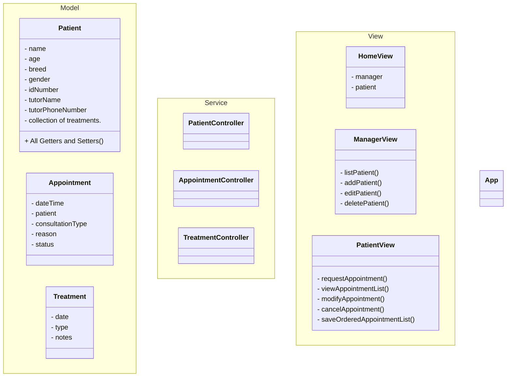

# BREMEN's Codeeers  
**Veterinary Clinic**

## Project Description with Synopsis
**Project Context:**
Margarita is about to open her veterinary clinic for cats and dogs and has requested the creation of a patient management system. Margarita has asked us to create a REST API that stores data in an in-memory database (H2 Database) or Dockerized MySQL, and can be consumed from the front end.

**Project Description:**
The goal of this project is to develop a patient management system in Java that allows Margarita to list, add, edit, and delete patients. The application will also allow users to manage their appointments efficiently (request appointments, view a list of appointments, modify and cancel appointments), keeping an organized record of them.

**Project Objectives:**
Reinforce students' understanding of object-oriented programming concepts.
Apply encapsulation to hide the internal implementation of classes and protect data.
Develop a flowchart explaining the customer management system.
Develop code representing the proposed diagram.

**Functional Requirements of the Project:**
List, add, modify, and delete patients.
Each patient must have a profile that includes:
Name
Age
Breed
Gender
Identification number
Tutor's full name
Tutor's phone number
Patient data must be accessible via their identification number.
The API must provide the treatments performed on each patient.
List, add, modify, and delete appointments.
Each appointment will include:
Date and time
Patient
Standard consultation / emergency
Reason for the appointment
Appointment status (pending, passed)

**Extras:**
Add an image to each patient's profile (Using Firebase Storage)
User registration
DTOs
Dockerize the application

**Technical Requirements of the Project:**
Knowledge of Java programming.
Knowledge of Object-Oriented Programming (OOP).
Good practices
Unit tests (Models, Services, and Controllers)
Evaluation Modality: Team project.

**Expected Deliverables:**
A patient management system implemented in Java, using the Spring framework and Spring Boot, that meets the requirements outlined above.
Controllers, services, and models tested.
Test coverage: 70%
GitHub repository with the corresponding README
Screenshot of test coverage
Presentation showing the entire development process
Project Timeline: 3-week sprint

**Performance Criteria:**
The backend architecture layers must be well defined.
Database tables should be normalized.
Unit tests

## Pre-requisites  
(What needs to be installed in order to run the project)

## Installation Steps

## Running Tests  
(Screenshot of test coverage)

## Diagrams Created

## Authors  
@abdiaslabrador @Andreina2 @KARELIZ01 @NelliYanchuk @ofiucoder

# Codeeers

## …or create a new repository on the command line  
    echo "# ClinicaVeterinaria" >> README.md  
    git init  
    git add README.md  
    git commit -m "first commit"  
    git branch -M main  
    git remote add origin https://github.com/coder0fiu/ClinicaVeterinaria.git  
    git push -u origin main

## …or push an existing repository from the command line  
    git remote add origin https://github.com/coder0fiu/ClinicaVeterinaria.git  
    git branch -M main  
    git push -u origin main
